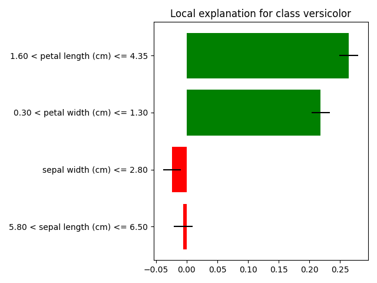

# lime + Bayeslime

This project is a friendly fork of Lime to incorporate Bayeslime.  Bayeslime is a bayesian variant of the original lime framework that measure the *uncertainty* of any given explanation.

Why is this good? This allows us to express whether we're confident we've found a good explanation. Meaning, with Bayeslime we can say we're 95% sure the feature importances for any given explanation fall in a certain range. 

*Critically*, we can also use our uncertainties to be a bit smarter about how we find explanations, resulting in better explanation quality.  For example, we can run the explainer until we're sure our explanations have a very small amount of uncertainty.  This results in explanations that are faithful to the model being explained.

## How to use Bayeslime

Bayeslime is structured to be familiar if you've worked with lime before. For example, you can call a bayeslime explanation in the exact same way you call a lime explanation.

```sh
explainer = bayeslime.lime_tabular.LimeTabularExplainer(train,
                                                       feature_names=iris.feature_names, 
                                                       class_names=iris.target_names, 
                                                       discretize_continuous=True)


exp = explainer.explain_instance(test[1], 
                                 rf.predict_proba, 
                                 num_features=4, 
                                 labels=(1,),
                                 num_samples=1_000)

exp.as_list()
```

This will return the following explanation.

```sh
[('1.60 < petal length (cm) <= 4.35', 0.2726653058786901, (0.24238007773404058, 0.3029505340233396)), ...]
```

The interpretation is that the feature importance of the most important feature is 0.273.  The uncertainty (defined as the 95% credible interval is (0.242, 0.303).  Because we're being bayesian, the uncertainty *has an intuitive interpretation*. result means the *true* feature importance will be found in this range 95% of the time. 

Bayeslime also includes additional methods to generate explanations to make sure they're confident.  For example, we can run the explanation until we're 95% sure the ranking of the feature importances is correct. Using the following configuration, this will increase the number of samples used in batches of 1,000  until we've collected enough samples for us to be confident in the explanation.

```sh
exp = explainer.explain_instance(test[1], 
                                 rf.predict_proba, 
                                 sample_until_confident=True,
                                 num_features=4, 
                                 labels=(1,),
                                 num_samples=1_000)
```

Note, the plotting still works the same as in lime with the addition of the credible intervals.  For example, the previous command on the iris dataset generates the following plot.

{:refdef: style="text-align: center;"}  {: width="200" } {: refdef}


